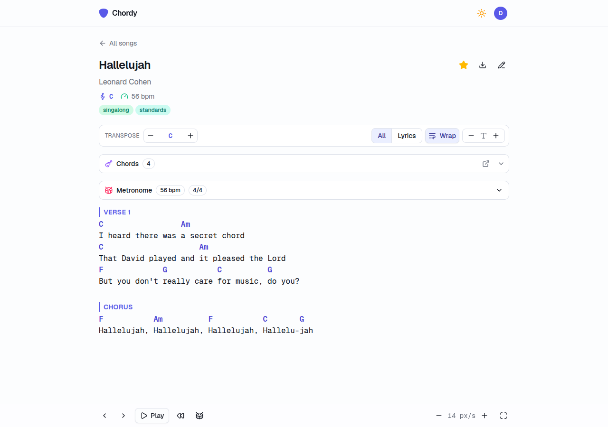

# Chordy

A private, self-hosted web app for your guitar chord sheets.



- **Transpose** to any key, saved per song, with every chord diagram following
- **Chord diagrams for every chord in the sheet** — tap one for its fingerings from a database of
  2,000+ guitar voicings, draw your own when none fits, and pin the shape this song actually uses
- **Metronome** with a kick/snare/hat grid you can edit step by step, time-signature presets from
  2/4 to 12/8 shuffle, tempo saved per song, and a playhead showing where you are in the bar
- **Play mode** — hands-free auto-scroll at a speed you set per song, the screen kept awake, and a
  fullscreen stage mode with keyboard shortcuts
- **Installable** on a phone or desktop as a PWA, with a dark mode that suits a dim stage
- Fuzzy search, tags, favourites, capo and BPM, YouTube tutorial embeds, Markdown export, print
- Sign in by emailed link or six-digit code — no passwords to manage

One container, one file on disk, no external services.

## Tech stack

- [Next.js](https://nextjs.org)
- [SQLite](https://sqlite.org) via [better-sqlite3](https://github.com/WiseLibs/better-sqlite3)
- [Tailwind CSS](https://tailwindcss.com) + [shadcn/ui](https://ui.shadcn.com) on [Radix](https://www.radix-ui.com) primitives, with [Lucide](https://lucide.dev) icons and [next-themes](https://github.com/pacocoursey/next-themes)
- [Better Auth](https://www.better-auth.com)
- [chords-db](https://github.com/tombatossals/chords-db) + [react-chords](https://github.com/tombatossals/react-chords)
- [Fuse.js](https://www.fusejs.io)

## Running it

You need Docker and an `.env` file:

```bash
cp .env.example .env
# put a secret in it
node -e "console.log(require('node:crypto').randomBytes(32).toString('base64url'))"
```

Then:

```bash
mkdir -p data
docker compose up -d
```

It listens on port 3000. The database is a single SQLite file at `data/chordy.db`.

**The `data` directory must be writable by the container**, which runs as uid 1000. If the log
says `SQLITE_CANTOPEN`, that is what happened:

```bash
sudo chown -R 1000:1000 data
```

### Without compose

```bash
docker run -d --name chordy -p 3000:3000 \
  -v "$PWD/data:/app/data" \
  --env-file .env \
  ghcr.io/meceware/chordy:latest
```

### Environment

| Variable | Needed | Notes |
|---|---|---|
| `AUTH_SECRET` | yes | Any long random string. Changing it signs everyone out. |
| `SITE_URL` | yes | Public URL, no trailing slash. Sign-in links are built from it. |
| `DATABASE_PATH` | no | Defaults to `/app/data/chordy.db` in the container. |
| `EMAIL_SERVER_HOST` | no | SMTP host. **Without it, sign-in emails are printed to the container log** — fine for a single user, since `docker logs chordy` shows the code. |
| `EMAIL_SERVER_PORT` | no | 587 by default. Use 465 for implicit TLS. |
| `EMAIL_SERVER_USER`, `EMAIL_SERVER_PASSWORD` | no | Leave empty for a relay that authenticates by IP. |
| `EMAIL_FROM` | no | Must be an address your SMTP server may send as. |

Anyone who can reach the login page can create an account, so put it behind something — a VPN, or
Cloudflare Access, or a reverse proxy with auth — if it is on the open internet.

## Building the image yourself

```bash
docker build -t chordy .
docker run -d --name chordy -p 3000:3000 -v "$PWD/data:/app/data" --env-file .env chordy
```

Multi-arch images for amd64 and arm64 are published to `ghcr.io` on every push to `main` and on
every `v*` tag.

## Development

```bash
npm ci
cp .env.example .env     # add AUTH_SECRET
npm run migrate
npm run seed             # optional: six demo songs
npm run dev
```

Sign-in emails go to the terminal. Node 24 — `nvm use` picks it up from `.nvmrc`.

### Backups

Use `npm run backup` rather than copying `chordy.db`. From the host, against a running container:

```bash
docker exec chordy node scripts/backup.js
```

A backup is not a backup until you have restored it somewhere and opened the app against it.
